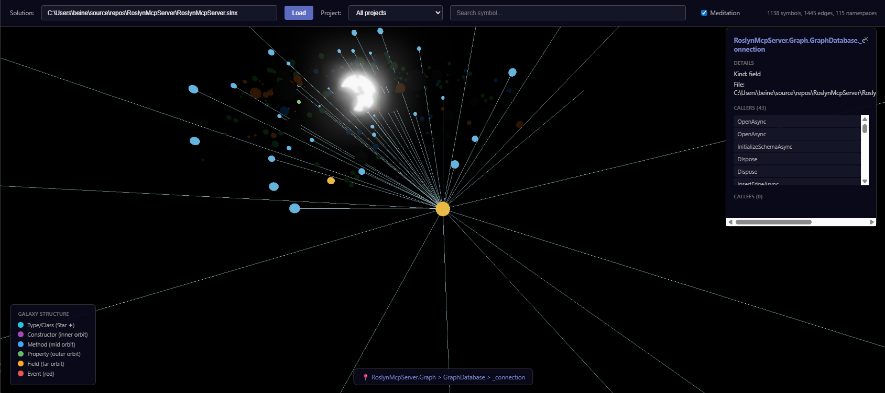

# Roslyn MCP Server

A server that gives Claude deep understanding of your C# code using Microsoft's Roslyn compiler.

## What Is This?

When you use **Claude Code** (Anthropic's AI coding assistant for the terminal), it normally treats your code as text. This works, but it can:
- Find the wrong `Save` method when you search for "Save"
- Read entire 2000-line files just to see one method
- Break code when doing find/replace refactoring

**Roslyn MCP Server** gives Claude the same understanding of C# that your IDE has. It knows `User` the class is different from `user` the variable.

| Without This Server | With This Server |
|---------------------|------------------|
| `grep "Save"` finds 50 text matches | Finds the exact `UserService.Save()` method |
| Reads whole file to find one method | Returns just that method |
| Find/replace can match wrong code | Targets exactly the right symbol |

## Prerequisites

Before you start, you need:

1. **.NET 10.0 SDK** - [Download from Microsoft](https://dotnet.microsoft.com/download)
2. **Visual Studio 2022** (any edition) or **Build Tools for Visual Studio** - needed for MSBuild
3. **Claude Code CLI** - Anthropic's terminal-based AI assistant. Install with:
   ```bash
   npm install -g @anthropic-ai/claude-code
   ```
   Then authenticate: `claude` and follow the prompts.

## Quick Start (5 Steps)

### Step 1: Download and Build the Server

```bash
git clone https://github.com/BeinerChes/RoslynMcpServer.git
cd RoslynMcpServer
dotnet build
```

Note the full path to the RoslynMcpServer folder (e.g., `C:\Dev\RoslynMcpServer`). You'll need it in Step 2.

### Step 2: Tell Claude Code About the Server

Create a file called `.mcp.json` in your C# project's root folder (where your `.sln` file is):

```json
{
  "mcpServers": {
    "roslyn": {
      "type": "stdio",
      "command": "dotnet",
      "args": ["run", "--project", "C:\\Dev\\RoslynMcpServer"]
    }
  }
}
```

**Important:** Replace `C:\\Dev\\RoslynMcpServer` with the actual path from Step 1. Use double backslashes on Windows.

### Step 3: Add Instructions for Claude

Create a file called `CLAUDE.md` in your project root. This file tells Claude HOW to work with your code.

**Option A: Get a template from the server** (recommended)

Start Claude Code in your project folder, then ask:
```
Get the standard template using roslyn_get_template
```

Claude will fetch the template and you can save it as CLAUDE.md.

**Option B: Download directly**
```bash
curl -o CLAUDE.md https://raw.githubusercontent.com/BeinerChes/RoslynMcpServer/rc/1.0.2/CLAUDE_TEMPLATE.md
```

**What is CLAUDE.md?** It's a file that Claude reads to understand your project's conventions. With Roslyn MCP, it tells Claude to use Roslyn tools instead of basic text search/replace. You don't execute anything in this file - Claude reads it automatically.

### Step 4: Start Claude Code

Open a terminal in your project folder and run:
```bash
claude
```

The Roslyn server should connect automatically. You'll see it listed when you type `/mcp`.

### Step 5: Verify It's Working

Ask Claude:
```
Find all types containing "Controller" in this solution
```

If it uses `roslyn_find_symbol`, everything is working. If it uses `grep`, check that:
- The `.mcp.json` file is in your project root
- The path to RoslynMcpServer is correct
- The `CLAUDE.md` file exists

## Available Templates

The server provides different CLAUDE.md templates for different workflows:

| Template | Best For | Get It |
|----------|----------|--------|
| `minimal` | Quick setup, basic Roslyn tools | `roslyn_get_template(template: "minimal")` |
| `standard` | Most projects - tools + git workflow | `roslyn_get_template(template: "standard")` |
| `tdd` | Test-driven development teams | `roslyn_get_template(template: "tdd")` |
| `team` | Full workflow with issues + TDD | `roslyn_get_template(template: "team")` |

Ask Claude to fetch any template: "Get the tdd template using roslyn_get_template"

## Why CLAUDE.md Matters

Without `CLAUDE.md`, Claude uses basic file operations:
- Reads entire files with `cat` or `Read`
- Searches with `grep` (finds text, not symbols)
- Edits with pattern matching (can match wrong code)

With `CLAUDE.md` pointing to Roslyn tools:
- Reads just the method you need
- Searches semantically (finds the right `Save()` method)
- Edits precisely (modifies exactly one method)

The CLAUDE.md file is instructions **for Claude to read**, not commands for you to run. You create it once and Claude follows it automatically.

## Available Tools

| Tool | Description |
|------|-------------|
| `roslyn_find_symbol` | Search for types, methods, properties by name pattern |
| `roslyn_get_references` | Find all usages of a symbol across the solution |
| `roslyn_get_callers` | Find all callers of a method (only call sites, not declarations) |
| `roslyn_get_implementations` | Find all implementations of an interface or derived classes |
| `roslyn_get_type_members` | List all members (methods, properties, fields) of a type |
| `roslyn_get_method_body` | Get the full source code of a specific method |
| `roslyn_update_method` | Replace a method's implementation |
| `roslyn_add_member` | Add a new method/property/field to a type |
| `roslyn_delete_member` | Delete a method/property/field from a type (includes attributes, XML docs) |
| `roslyn_get_diagnostics` | Compile and get warnings/errors (CS* and CA* rules) |
| `roslyn_apply_code_fix` | Apply Roslyn's suggested fix for a single diagnostic |
| `roslyn_batch_apply_code_fixes` | Batch apply fixes for all diagnostics of a specific type |
| `roslyn_rename_symbol` | Rename a symbol across the entire solution with all references |
| `roslyn_get_projects_in_build_order` | Get solution structure and dependencies |
| `roslyn_graph_status` | Check if a call graph database exists for a solution |
| `roslyn_graph_analyze` | Build or update the call graph database |
| `roslyn_query_graph` | Query callers/callees with recursive depth (auto-refreshes stale files) |
| `roslyn_graph_impact` | Analyze blast radius - what breaks if you change a symbol (auto-refreshes) |
| `roslyn_find_dead_code` | Find methods/properties with no callers (see limitations below) |

### Dead Code Detection Limitations

`roslyn_find_dead_code` uses static analysis and may produce **false positives** for:
- **DTO properties** used via JSON serialization (reflection-based access cannot be tracked)
- **Properties without attributes** in model classes

The tool automatically excludes:
- Entry points (`Main`, `RunAsync`, event handlers)
- Properties with any attributes (likely used for serialization)
- External/BCL symbols
- Test files (optional)

Review results carefully - some flagged code may be used via reflection.

## Usage Examples

### Find a Symbol

```
Find all types containing "Layer" in the solution
```

Claude will use `roslyn_find_symbol` to semantically search for types.

### Understand a Large Class

```
What methods does FeatureLayer have?
```

Claude will use `roslyn_get_type_members` to list all members without reading the entire file.

### Safe Method Editing

```
Fix the null reference bug in FeatureLayer.BuildCachedData
```

Claude will:
1. Use `roslyn_get_method_body` to get just that method
2. Apply the fix
3. Use `roslyn_update_method` to replace it precisely

### Add New Functionality

```
Add a Dispose method to the CacheManager class
```

Claude will use `roslyn_add_member` with proper formatting.

### Find Code Health Issues

```
What warnings does the MyApp.Core project have?
```

Claude will use `roslyn_get_diagnostics` to compile and summarize issues.

## 3D Call Graph Visualization

The server includes a web-based 3D visualization of your codebase's call graph:



### Features
- **Galaxies** = Namespaces (sphere clusters, most connected in center)
- **Stars** = Types (white, sized by total callers)
- **Planets** = Methods/Properties (orbiting stars, sized by callers)
- Click to select and focus, dimming other objects
- Controls: Left mouse = pan, Middle mouse = rotate, Scroll = zoom

### Running the Visualization

1. First, build the call graph:
   ```
   Ask Claude: "Analyze the call graph for this solution"
   ```
   Claude will use `roslyn_graph_analyze` to build the database.

2. Start the web server:
   ```bash
   dotnet run --project RoslynMcpServer.Web
   ```

3. Open http://localhost:5000 and enter your solution path.

### Find .NET Analyzer Warnings (CA* rules)

```
Find all CA1806 warnings in the solution
```

The server includes Microsoft.CodeAnalysis.NetAnalyzers, so it detects the same CA* rules as Visual Studio:
- **CA1806** - Do not ignore method results
- **CA2000** - Dispose objects before losing scope
- **CA1062** - Validate arguments of public methods
- And 200+ more rules...

### Auto-Fix Warnings

```
Fix the CS0168 warning at line 42 in VectorTileLayer.cs
```

Claude will use `roslyn_apply_code_fix` to automatically apply Roslyn's suggested fix.

### Rename a Symbol

```
Rename the GetData method in DataService to FetchDataAsync
```

Claude will use `roslyn_rename_symbol` to safely rename the method and update all references across the solution.

## Troubleshooting

### "Solution file not found"

Ensure you're using an absolute path to the `.sln` or `.slnx` file.

### Server not responding

The server may be locked during rebuild. Kill it and reconnect:

```bash
# Find the process
tasklist | findstr RoslynMcpServer

# Kill it
taskkill /F /PID <pid>

# Reconnect in Claude Code
/mcp reconnect roslyn
```

### MSBuild errors

Ensure Visual Studio 2022 or Build Tools are installed. The server uses `MSBuildLocator` to find MSBuild.

### Slow first load

The first operation loads the entire solution into memory. Subsequent operations are faster.

## Architecture

```
RoslynMcpServer/
├── RoslynMcpServer/              # Main MCP server
│   ├── Program.cs                # Entry point
│   ├── McpServer.cs              # MCP protocol (JSON-RPC over stdio)
│   ├── RoslynTools.*.cs          # Tool registrations (partial class)
│   └── SolutionAnalyzerService.*.cs  # Roslyn logic (partial class)
├── RoslynMcpServer.Graph/        # Call graph database
│   ├── GraphDatabase.cs          # SQLite-based call graph storage
│   └── GraphAnalyzer.cs          # Builds call graph from Roslyn
├── RoslynMcpServer.Web/          # 3D visualization web app
│   ├── Program.cs                # ASP.NET minimal API
│   ├── GraphApi.cs               # REST endpoints for visualization
│   └── wwwroot/index.html        # Three.js 3D visualization
└── RoslynMcpServer.Tests/        # Unit tests
```

The server uses:
- **MSBuildWorkspace** to load solutions
- **Roslyn Compiler APIs** for semantic analysis
- **Roslyn Formatter** for code formatting
- **Bundled .NET Analyzers** for CA* diagnostic rules
- **SQLite** for call graph persistence
- **Three.js** for 3D visualization
- **JSON-RPC 2.0** over stdio for MCP communication

## Roadmap

### Planned Tools (High Priority)

| Tool | Description | Use Case |
|------|-------------|----------|
| `roslyn_extract_method` | Extract code block into new method | Refactoring large methods |
| `roslyn_change_signature` | Add/remove/reorder parameters | API changes with auto-fix callers |
| `roslyn_get_document_symbols` | All symbols in a specific file | Quick file overview |
| `roslyn_organize_usings` | Sort + remove unused usings | Code cleanup |
| `roslyn_format_document` | Apply .editorconfig formatting | Consistent style |

### Planned Tools (Medium Priority)

| Tool | Description |
|------|-------------|
| `roslyn_extract_interface` | Extract interface from class |
| `roslyn_move_type_to_file` | Move class to its own .cs file |
| `roslyn_encapsulate_field` | Convert field to property with backing field |
| `roslyn_generate_constructor` | Create constructor from fields/properties |
| `roslyn_pull_members_up` | Move members to base class |
| `roslyn_push_members_down` | Move members to derived classes |

## License

MIT

## Files in This Repository

| File | Purpose |
|------|---------|
| `README.md` | This file - how to install and use the server |
| `CLAUDE_TEMPLATE.md` | **Copy this to your projects** as `CLAUDE.md` - tells Claude to use Roslyn tools |
| `CLAUDE.md` | Instructions for developing this repository itself (not for end users) |
| `.mcp.json` | Example MCP configuration for Claude Code |

## Contributing

Issues and PRs welcome. See `CLAUDE.md` for development guidelines for this repository.
