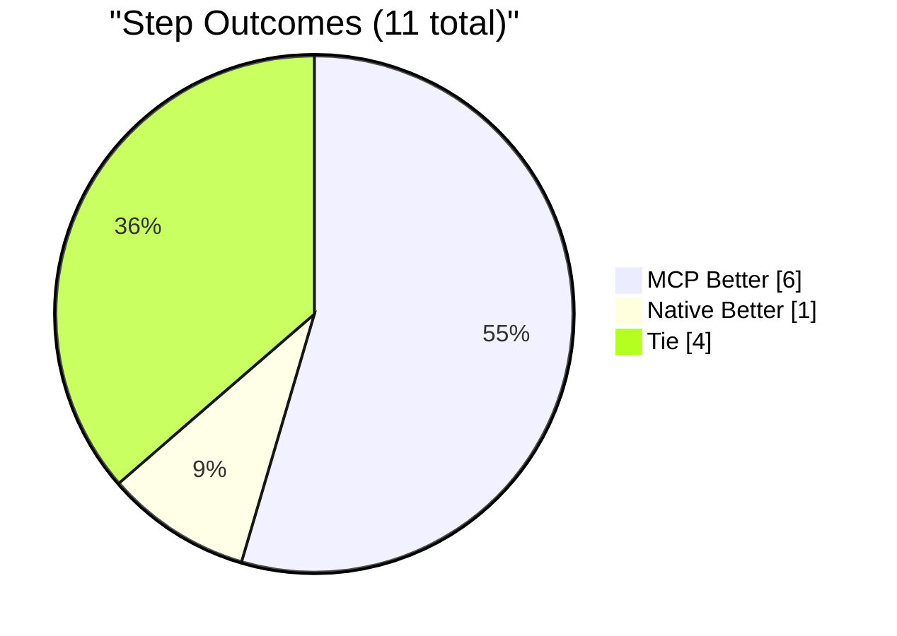
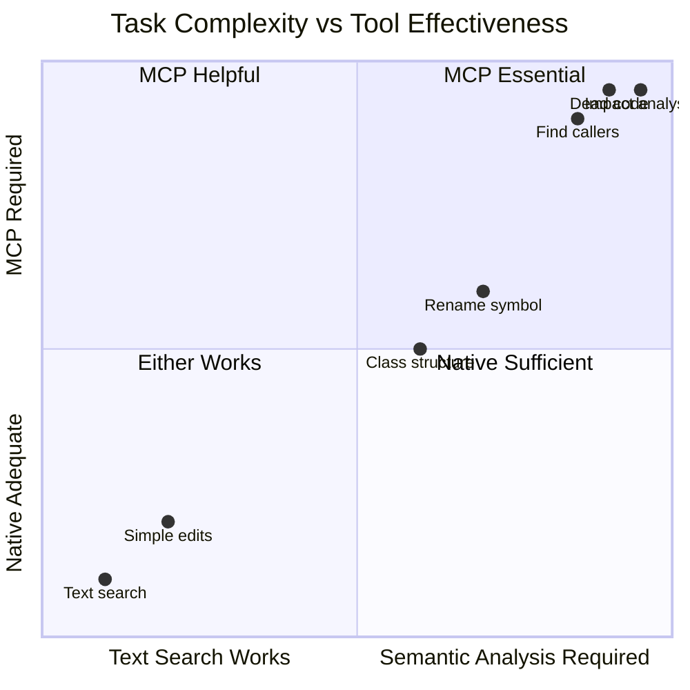

# Benchmark Results: Roslyn MCP vs Native Claude Code Tools

**Date:** 2026-01-26
**Solution:** Atlas3.sln (36 projects, ~500K lines of C#)
**Target Class:** `Atlas.Data.FeatureSet` (155 members across 13 partial files)

---

## Executive Summary

| Metric | MCP Tools | Native Tools |
|--------|-----------|--------------|
| **Tool Calls** | 11 | 38 |
| **Context Tokens** | 123.3K | 233.3K |
| **Accuracy** | 55/55 (100%) | 44/55 (80%) |
| **Steps Completed** | 11/11 | 9/11 |

---

## Visual Comparison

### Overall Efficiency

```mermaid
xychart-beta
    title "MCP vs Native: Key Metrics"
    x-axis ["Tool Calls", "Context (K tokens)", "Accuracy %"]
    y-axis "Value" 0 --> 250
    bar [11, 123, 100]
    bar [38, 233, 80]
```

### Context Tokens by Phase

```mermaid
xychart-beta
    title "Context Token Usage (thousands)"
    x-axis ["Navigation", "Modification", "Diagnostics", "TOTAL"]
    y-axis "Tokens (K)" 0 --> 250
    bar "MCP" [91, 4, 28, 123]
    bar "Native" [149, 6, 50, 233]
```

### Tool Calls by Step

```mermaid
xychart-beta
    title "Tool Calls per Step"
    x-axis ["1: Structure", "2: Method", "3: Callers", "4: Impact", "5: Related", "6: Add", "7: Update", "8: Rename", "9: Delete", "10: Diag", "11: Dead"]
    y-axis "Calls" 0 --> 15
    bar "MCP" [1, 1, 1, 1, 1, 1, 1, 1, 1, 1, 1]
    bar "Native" [14, 0, 1, 3, 1, 1, 1, 2, 1, 1, 0]
```

### Accuracy Comparison

```mermaid
xychart-beta
    title "Accuracy Score by Step (out of 5)"
    x-axis ["1", "2", "3", "4", "5", "6", "7", "8", "9", "10", "11"]
    y-axis "Score" 0 --> 5
    bar "MCP" [5, 5, 5, 5, 5, 5, 5, 5, 5, 5, 5]
    bar "Native" [5, 5, 3, 1, 5, 5, 5, 5, 5, 5, 0]
```

### Where Each Approach Won

---

## The Key Insight

---

## Test Methodology

### The Task
11 steps covering three phases:
1. **Navigation** (Steps 1-5): Class structure, method lookup, caller tracing
2. **Modification** (Steps 6-9): Add, update, rename, delete methods
3. **Diagnostics** (Steps 10-11): Build analysis, dead code detection

### Controls
- Fresh Claude Code sessions for both tests
- Same solution, class, and task definitions
- Token tracking with identical methodology
- MCP disabled for native test

---

## Detailed Results

### Phase 1: Code Navigation

| Step | Task | MCP | Native |
|------|------|-----|--------|
| 1 | Class structure (155 members) | 1 call, 45K | 14 calls, 127K |
| 2 | Find Save() method | 1 call, 4K | 0 calls (cached) |
| 3 | Find callers | 1 call, 3K → 18 results | 1 call, 15K → 155 results |
| 4 | Impact analysis | 1 call, 10K → 44 symbols | Failed |
| 5 | Related methods | 1 call, 29K | 1 call, 2K |

**Step 3 detail:** Native grep found 155 `.Save()` matches. MCP found 18 actual `FeatureSet.Save()` callers. The difference: semantic analysis vs text matching.

**Step 4 detail:** Native tools cannot trace call graphs. MCP traversed pre-built graph in one call.

### Phase 2: Code Modification

| Step | Task | MCP | Native |
|------|------|-----|--------|
| 6 | Add method | 1 call, 0.9K | 1 call, 1.4K |
| 7 | Update method | 1 call, 1.6K | 1 call, 1.4K |
| 8 | Rename symbol | 1 call, 1.1K | 2 calls, 2K |
| 9 | Delete method | 1 call, 0.8K | 1 call, 1.4K |

Both approaches performed similarly. Native Edit worked well with files already in context.

### Phase 3: Diagnostics

| Step | Task | MCP | Native |
|------|------|-----|--------|
| 10 | Build diagnostics | 1 call, 12K | 1 call, 50K |
| 11 | Dead code | 1 call, 16K → 50 symbols | Not attempted |

---

## Limitations and Caveats

### What This Benchmark Does NOT Measure

1. **MCP startup overhead** - Solution loading takes 10-30 seconds on first use. Native tools have no startup cost. For quick one-off tasks, this overhead may outweigh benefits.

2. **Memory consumption** - MCP server holds the entire solution in memory (~500MB-2GB for large solutions). Not measured here.

3. **Real-world complexity** - This was a controlled test with specific tasks. Actual development involves exploration, backtracking, and tasks that don't fit neatly into categories.

4. **Caching effects** - Native tools benefited from caching in Step 2 (zero cost). In longer sessions, both approaches benefit differently from context accumulation.

5. **Task selection bias** - These tasks were chosen to exercise MCP capabilities. A benchmark focused on simple edits would show different results.

### Where Native Tools May Be Preferable

1. **Quick fixes** - Single-file edits don't need semantic analysis
2. **Unknown codebases** - Grep exploration before committing to solution load
3. **Non-C# files** - Config, scripts, docs (MCP only handles C#)
4. **Offline/portable** - No external server dependency

### Honest Assessment of Results

**Steps where MCP clearly helped (3):**
- Step 3: Caller detection without false positives
- Step 4: Call graph traversal (native cannot do this)
- Step 11: Dead code detection (native cannot do this)

**Steps where it didn't matter much (7):**
- Steps 1, 2, 5-10: Both approaches succeeded, token differences were moderate

**Step where native was better (1):**
- Step 5: Simple text search was more efficient (2K vs 29K tokens)

---

## Conclusions

### What the Data Shows

1. **For semantic queries (callers, impact, dead code):** MCP is the only viable option. Native tools cannot provide accurate results regardless of effort.

2. **For code modification:** Minimal difference. Native Edit is effective when files are in context.

3. **For class exploration:** MCP is more efficient for large/partial classes. For small classes, the difference is negligible.

4. **Overall efficiency:** MCP used 47% fewer tokens, but the absolute savings (~110K) matter more in long sessions than short ones.

### What the Data Does NOT Show

1. Whether the 10-30 second startup cost is worth it for small tasks
2. How results scale to different codebase sizes
3. Whether a skilled user with native tools could achieve better results with different strategies
4. Long-term session dynamics where context accumulation changes the equation

### Practical Takeaway

MCP tools solve problems that native tools cannot solve (call graphs, semantic search, dead code). For those specific problems, use MCP. For everything else, either approach works.

The "47% token savings" headline is less important than the capability gap: some tasks are simply not feasible without semantic analysis.

---

## Raw Data

- [MCP Detailed Results](results_mcp.md)
- [Native Detailed Results](results_native.md)
- [Test Task Definition](test_task.md)
- [MCP Session Prompt](benchmark_prompt_mcp.md)
- [Native Session Prompt](benchmark_prompt_native.md)
